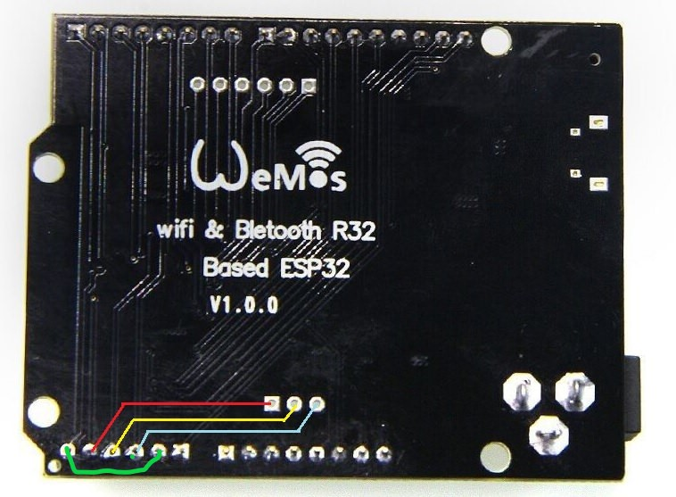

# ESP_TouchScreen

This is a 4-wire resistive touch screen library for ESP32 based on [Adafruit's Arduino](https://github.com/adafruit/Adafruit_TouchScreen) implementation.

Added modification to allow the 4-wire resistive touchscreen of LCDs with parallel data interfaces to be used with ESP32 UNO style boards whilst WiFi is enabled.

As the ADC in the ESP32 has some problems for accuracy the library also includes a function for error correction and mapping. It can be configured to use polinomial aproximation or linear interpolation between known points.

## Reason for Modification

### The problems:
1. All 4 pins for the resistive touchscreens must be able to work as digital outputs
2. If WiFi is enabled ADC1 cannot be used
3. ADC2 maps to pins from 32 to 39
4. Pins from 34 to 39 are input-only

### The solution:
The panel is driven by regular digital pins but is then switched to an analog pin (in the range 32-39) to perform the reading. However this requires additional wiring.
Any pin from 32 to 39 may be used for analog read but pins from 34 to 39 are recomended. Pins 34 to 39 are input only so they always present a high impedance, thus avoiding the risk of two outputs shorting.

## Hardware setup
Connect the touch panel as follows
- XP -> Any free pin from 2 to 33 (both included).
- XM -> Any free pin from 2 to 33 (both included).
- YP -> Any free pin from 2 to 33 (both included).
- YM -> Any free pin from 2 to 33 (both included).

Additionally make the following connections
- XM -> Any free pin from 32 to 39 (pins from 34 to 39 recomended)
- YP -> Any free pin from 32 to 39 (pins from 34 to 39 recomended)

*Example*

If using Arduino UNO style board with [TFT_eSPI](https://github.com/Bodmer/TFT_eSPI), make the following connections:




## Installing
Download and install the library using your IDE, eg Arduino or PlatformIO. 
If using Arduino IDE navigate to your library folder, open TouchSetup.h and set your preferences. Defaults should work for most common configurations.

If using PlatformIO we recomment using "-build_flags" in your platformio.ini file.

## Software Setup
**Arduino Basic setup**
1. Find the file called `TouchSetup.h` in your library folder.
2. Open the file in any text editor and locate the following lines:
```
- #define aXM xx
- #define aYP yy
```
5. Change the values "xx" and "yy" to the analog pins connected to XM and YP(must be between 32 and 39).

*Optional*
5. Select mapping method: Polynomial or Grid. Comment the `#define POLYNOMIAL` line for Grid method.
6. Run the calibration example to get the calibration values
7. Paste the output values into `TouchSetup.h`

**Platform IO Basic Setup**
1. Open platform.ini file
2. Add the following lines
```
-D TOUCH_SETUP_LOADED=1
-D aYP=xx
-D aXM=yy
```
4. Change the values "xx" and "yy" to the analog pins connected to XM and YP(must be between 32 and 39).
*Optional*
5. Select mapping method: Polynomial or Grid. Default mode is Grid. Add `-D POLYNOMIAL=1` to enable polynomial method.
6. Run the calibration example to get the calibration values
7. Paste the output values into `TouchSetup.h`

## Using

Check the provided examples for information about how to use the library.

Compatible with both [TFT_eSPI](https://github.com/Bodmer/TFT_eSPI) and [MCUFRIEND_kbv](https://github.com/prenticedavid/MCUFRIEND_kbv/) libraries

**Touchscreen needs to be calibrated before use!** We recomment using included [touch calibration sketch](examples/touch_calib)  
